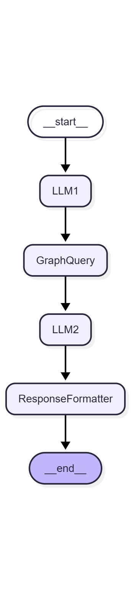

# 🍹 WORKSHOP : cocktail-recommender
> 본 레포지토리는 [project_ScentRAG](https://github.com/dibk100/project_ScentRAG)를 기반으로 고도화된 버전이고, workshop 최종본은 [Cocktail_Rec_AgentRAG](https://github.com/diddbwls/cocktail_rec_agentrag)에서 정리함.

- Subject : GraphRAG를 활용한 에이전트 기반 검색 강화 추천 시스템 개발
- Accepted : http://rdgenai2025.kisti.re.kr/
- Role : LangChain 기반 파이프라인 구축

## 🚀 Getting Started 
### 1. 가상환경 생성(권장) & 패키지 설치
```
/workshop_cocktail-recommender$ conda create -n workshop_311 python=3.11
/workshop_cocktail-recommender$ conda activate workshop_311
/workshop_cocktail-recommender(workshop_311)$ pip install -r requirements.txt
```
### 2. Test 파이프라인 실행
처음에 LLM모델 불러오느라 시간 걸림.
```
test_pipeline.ipynb
```

<details> <summary> CODA out of memory </summary>
불필요한 파일, 오래된 캐시, 다운로드 파일 등을 삭제

```
# Hugging Face 캐시 정리
rm -rf ~/.cache/huggingface/hub
rm -rf ~/.cache/huggingface/transformers
```

실행중인 것 kill
```
# GPU모니터링
watch -n 1 nvidia-smi
```
</details>

### 3. Git Branch

```
git checkout -b [브랜치명]
git fetch
```

## 📌 Notes & Issues (update.2025-09-15) 🧷
- neo4j 미연결
- LLM(1), LLM(2) : Qwen/Qwen2.5-VL-3B-Instruct
- 현재 llm_response.py와 graph_nodes.py는 더미 형태로 구현 
- llm(1) 프롬프트를 json형태로 출력하도록 함.

## 📁 Folder Structure
```
project_root/
│
├─ pipeline.py                # 메인 파이프라인 정의/실행 (LangGraph EntryPoint)
│
├─ nodes/                     
│   ├─ task_classifier.py       
│   ├─ retriever.py        
│   ├─ checking_hop.py         
│   └─ generator.py       
│
├─ core/                      
│   ├─ config.py              # 환경 변수 및 설정
│   ├─ llm_model.py           # Hugging Face Qwen2.5-VL-7B-Instruct 
│   ├─ promptloader.py         
│   ├─ utils.py               
│   └─ schemas.py             # Pydantic 기반 PipelineState 정의
│
├─ prompts/                      
│   ├─ embedding_config.json              
│   ├─ base_system.json            
│   ├─ c1_visual_similarity.json        
│   ├─ c2_taste_profile.json
│   ├─ c3_classification.json
│   ├─ c4_recipe_ingredients.json
│   └─ task_classifier.json
│
├─ tests/                     # 단위/통합 테스트
│   └─ test_pipeline.py       # 예시 질의 3개 테스트
│
├─ graph_viz/                     # 시각화
│   ├─ visualize_pipeline.ipynb
│   └─ mermaid_code.mmd       
│
└─ requirements.txt
```

## ⚙️ LangGraph 파이프라인 설계

<details> <summary> 구조 </summary>
flow

```
[User Input] 
      │
      ▼
 [LLM(1) Node] ──> 속성 추출 & Graph Query
      │
      ▼
 [Graph Query Node] ──> Neo4j에서 후보 칵테일 조회
      │
      ▼
 [LLM(2) Node] ──> 최종 추천 텍스트 생성
      │
      ▼
 [Response Node] ──> 사용자 출력
```
</details>

